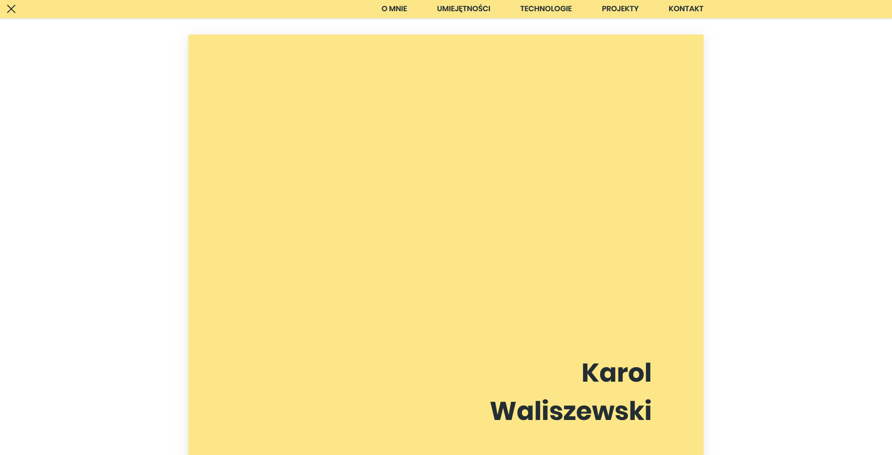

# Portfolio
> Portfolio had been created by myself from scratch, including graphics and code aspect.

## Development :wrench:

+ All the designs were made by me in the [Adobe Experience Desing](https://www.adobe.com/products/xd.html).

+ Contact form is working thanks to [EmailJS](http://www.emailjs.com/) implementation.

+ I used [normalize.css](https://necolas.github.io/normalize.css/) to make my website look the same in every browser.

+ [Gulp](https://gulpjs.com/) improved the workflow. Live preview etc. made the work faster. [There](https://github.com/Karol-Waliszewski/Gulp-Workflow-Template) is a template for Gulp that I created. Feel free to use!

## Meta

Karol Waliszewski – [karolwaliszewski@gmail.com](mailto:karolwaliszewski@gmail.com)

https://github.com/Karol-Waliszewski

